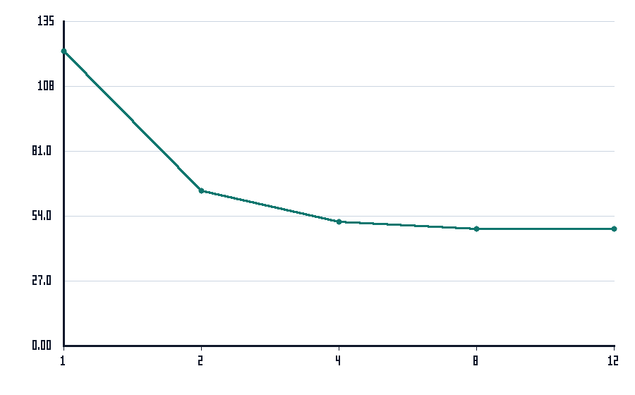
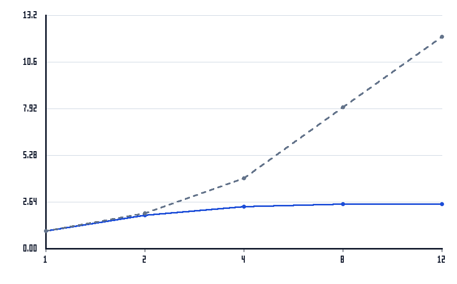
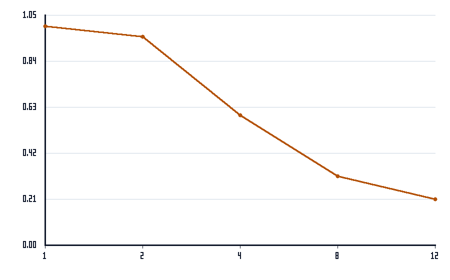

# Relatório da Paralelização do Avaliador de Arquivos de Log

**Disciplina:** Programação Concorrente e Distribuída
**Aluno(s):** Felipe Santiago
**Turma:** ADS05.1  
**Professor:** Rafael  
**Data:** 25/03/2026

---

# 1. Descrição do Problema

O problema consiste em analisar um grande conjunto de arquivos texto contendo logs operacionais para consolidar:

- total de linhas
- total de palavras
- total de caracteres
- contagem das palavras-chave `erro`, `warning` e `info`

A versão original fazia o processamento de forma serial, arquivo por arquivo. A solução implementada neste projeto evolui esse fluxo para uma versão paralela baseada no modelo produtor-consumidor com buffer limitado.

O produtor percorre a pasta de entrada e envia os caminhos dos arquivos para uma fila limitada. Os consumidores são processos Python independentes, que retiram arquivos da fila, processam seus conteúdos e consolidam resultados parciais. Ao final, o processo principal combina os parciais em um único resultado global.

Para validar a corretude foi usado o conjunto `log1`, cujo resultado esperado é:

- 600 linhas
- 12000 palavras
- 82085 caracteres
- `erro = 1993`, `warning = 1998`, `info = 1983`

Para os experimentos foi usado o conjunto `log2`, com:

- 1000 arquivos
- 10000000 linhas
- 200000000 palavras
- 1366663305 caracteres

O algoritmo tem custo aproximadamente linear no volume total processado, isto é, proporcional ao número total de linhas/palavras dos arquivos, somado ao custo da carga computacional simulada por linha. Em termos práticos, a complexidade é `O(n)`, onde `n` representa o tamanho total dos logs.

O objetivo da paralelização foi reduzir o tempo total de execução mantendo exatamente o mesmo resultado consolidado da versão serial.

---

# 2. Ambiente Experimental

Os testes foram executados em máquina local com os seguintes recursos:

| Item                        | Descrição |
| --------------------------- | --------- |
| Processador                 | Apple M2 |
| Número de núcleos           | 8 (4 Performance e 4 Efficiency) |
| Memória RAM                 | 8 GB |
| Sistema Operacional         | macOS 26.3.1 |
| Linguagem utilizada         | Python 3.9.6 |
| Biblioteca de paralelização | `multiprocessing` (biblioteca padrão) |
| Compilador / Versão         | Interpretador CPython 3.9.6 |

---

# 3. Metodologia de Testes

O tempo de execução foi medido com `time.perf_counter()`, que oferece medição de alta resolução.

As configurações testadas foram:

- 1 processo, correspondente à versão serial
- 2 processos
- 4 processos
- 8 processos
- 12 processos

Procedimento adotado:

- 3 execuções para cada configuração
- uso da média aritmética como tempo representativo
- mesma entrada `log2` em todas as execuções
- buffer limitado fixado em 32 posições
- validação da corretude comparando o resultado consolidado de todas as execuções com a linha de base serial

Condições de execução:

- testes feitos na mesma máquina local
- sem alteração do código entre uma execução e outra
- sem controle rígido de carga externa do sistema, o que explica pequenas oscilações entre repetições

Arquivos principais do projeto:

- `analisador_logs.py`: execução serial e paralela
- `benchmark.py`: automação do benchmark e geração dos gráficos
- `graficos_png.py`: geração dos gráficos PNG sem dependências externas

---

# 4. Resultados Experimentais

Tempos médios de execução medidos em segundos:

| Nº Threads/Processos | Tempo de Execução (s) |
| -------------------- | --------------------- |
| 1                    | 111.7984 |
| 2                    | 56.0168 |
| 4                    | 37.0008 |
| 8                    | 27.6310 |
| 12                   | 28.7712 |

---

# 5. Cálculo de Speedup e Eficiência

## Fórmulas Utilizadas

### Speedup

```text
Speedup(p) = T(1) / T(p)
```

Onde:

- `T(1)` = tempo da execução serial
- `T(p)` = tempo com `p` processos

### Eficiência

```text
Eficiência(p) = Speedup(p) / p
```

Onde:

- `p` = número de processos

---

# 6. Tabela de Resultados

| Threads/Processos | Tempo (s) | Speedup | Eficiência |
| ----------------- | --------- | ------- | ---------- |
| 1                 | 111.7984 | 1.0000 | 1.0000 |
| 2                 | 56.0168 | 1.9958 | 0.9979 |
| 4                 | 37.0008 | 3.0215 | 0.7554 |
| 8                 | 27.6310 | 4.0461 | 0.5058 |
| 12                | 28.7712 | 3.8858 | 0.3238 |

Observação: o melhor tempo absoluto foi obtido com 8 processos.

---

# 7. Gráfico de Tempo de Execução

Eixo X: número de processos  
Eixo Y: tempo médio de execução em segundos



---

# 8. Gráfico de Speedup

Eixo X: número de processos  
Eixo Y: speedup medido, com comparação visual com a linha ideal



---

# 9. Gráfico de Eficiência

Eixo X: número de processos  
Eixo Y: eficiência, com valores entre 0 e 1



---

# 10. Análise dos Resultados

Os resultados mostram que a paralelização trouxe ganho expressivo de desempenho, mas não linear. O melhor caso foi com 8 processos, reduzindo o tempo médio de `111.80s` para `27.63s`, com speedup de `4.05x`.

O speedup com 2 processos foi praticamente ideal (`1.9958x`), indicando que o problema possui trabalho suficiente para aproveitar paralelismo logo no primeiro nível. A partir de 4 processos a eficiência começou a cair de forma mais clara, embora o tempo total ainda continue melhorando.

Com 8 processos o programa atingiu o menor tempo médio, mas a eficiência caiu para `0.5058`. Isso indica que, apesar de ainda haver ganho de tempo, o crescimento deixou de ser proporcional ao número de processos.

Com 12 processos o desempenho piorou em relação a 8 processos. Isso era esperado, porque a máquina utilizada possui 8 núcleos totais, então 12 processos ultrapassam a capacidade disponível e passam a disputar CPU, cache e banda de memória de forma mais intensa.

Os principais fatores que explicam a perda de eficiência foram:

- overhead de criação e gerenciamento de processos
- sincronização implícita entre produtor, fila limitada e consumidores
- custo de comunicação entre processos
- contenção de leitura em disco e no subsistema de memória
- aumento de trocas de contexto ao ultrapassar a quantidade de núcleos disponíveis
- heterogeneidade do Apple M2, que combina núcleos de performance e de eficiência

Em resumo, a aplicação apresentou escalabilidade até 8 processos, mas com ganhos marginais decrescentes. Depois desse ponto, o overhead passou a superar o benefício adicional de paralelizar mais.

---

# 11. Conclusão

O paralelismo trouxe ganho significativo de desempenho para o processamento dos logs. A solução serial levou em média `111.80s`, enquanto a melhor configuração paralela, com 8 processos, levou `27.63s`.

Isso mostra que o modelo produtor-consumidor com buffer limitado foi adequado para o problema e preservou a corretude dos resultados. Ao mesmo tempo, os experimentos mostram que aumentar indefinidamente o número de processos não garante melhoria contínua.

A melhor configuração observada neste ambiente foi:

- 8 processos
- tempo médio de `27.63s`
- speedup de `4.05x`

Melhorias futuras possíveis:

- ajustar dinamicamente o tamanho do buffer
- testar particionamento por blocos menores de trabalho
- reduzir overhead de IPC
- experimentar afinidade de processos e ajustes específicos para CPUs heterogêneas

---

# Como Executar

Validar com `log1`:

```bash
python3 analisador_logs.py --modo serial --pasta ../log1
python3 analisador_logs.py --modo paralelo --pasta ../log1 --processos 2 --buffer 4
```

Executar benchmark com `log2`:

```bash
python3 benchmark.py --pasta ../log2 --repeticoes 3 --processos 2 4 8 12 --buffer 32
```

Arquivos gerados:

- `resultados/benchmark_log2.json`
- `resultados/benchmark_log2.csv`
- `graficos/tempo_execucao.png`
- `graficos/speedup.png`
- `graficos/eficiencia.png`
